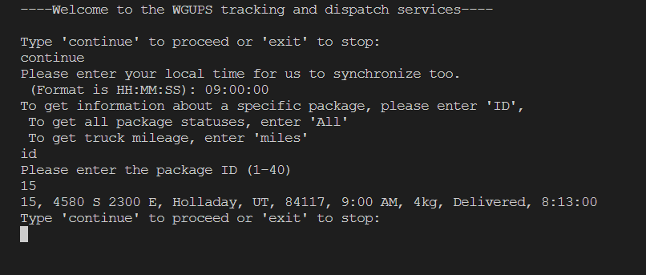
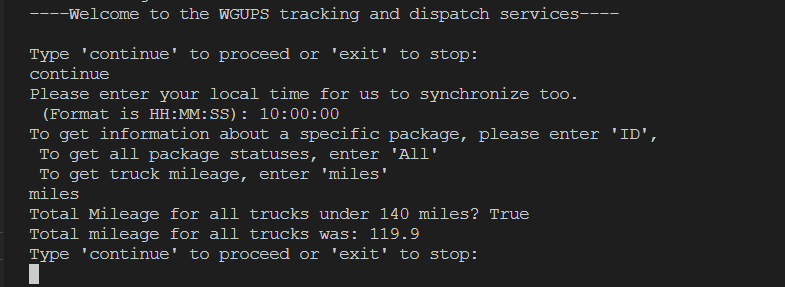
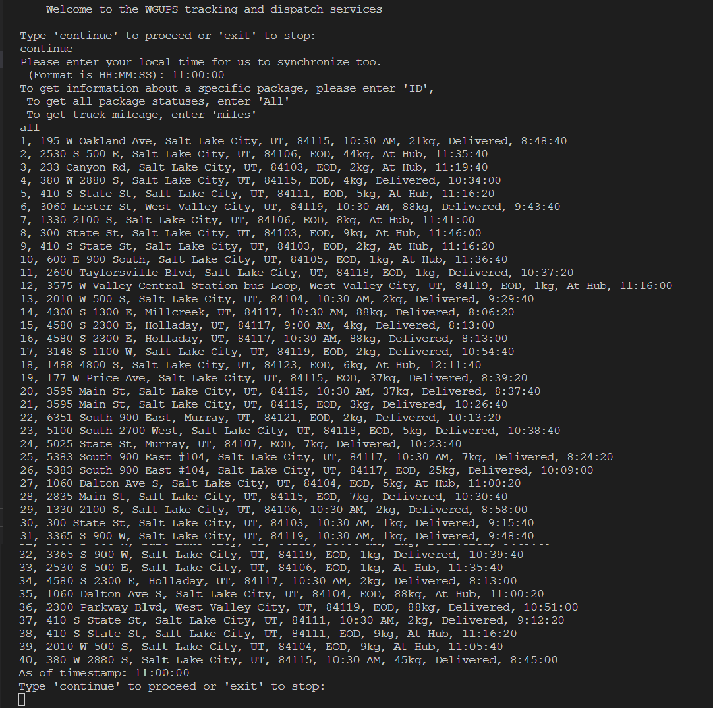

# Truck-Delivery-Algorithm
An Algorithm created with the purpose of figuring out the most efficient way to deliver packages with 3 trucks and 2 drivers. Imports CSV data to determine shortest routes.

This algorithm is a greedy algorithm implementing a form of the "Nearest Neighbor". The nearest neighbor compares the trucks current location to the nearest package address. It accomplishes this by looping through each package loaded on the truck and then compares all other packages within a nested loop. Due to the nature of the double loops, the Time complexity would be a Big O(N^2). The space complexity however is linear, as the amount of data accessed will increase or decrease based on the size of our CSV files, giving it a big O(N). The data structure used is a hash table, using a modulus hash function based on its length to store key value pairs. The hash table has a time complexity of Big O(1) or constant, and a space complexity of Big (N) for due to the linear scaling nature of data.

The following image shows the simple text UI, wherein, a customer enters a time to see the status of packages or trucks.
In this case a customer may want to view the status of their package with the ID of 15, which will be delivered by 8.13am
Note text inputs can be in upper or lowercase for usability. 

This image shows the mileage driven by all trucks to deliver all packages, one task was to deliver all packages within 40 miles.
This algorithm accomplished it with 20.1 miles to spare.

The final image is the 'all' function to view all packages:

